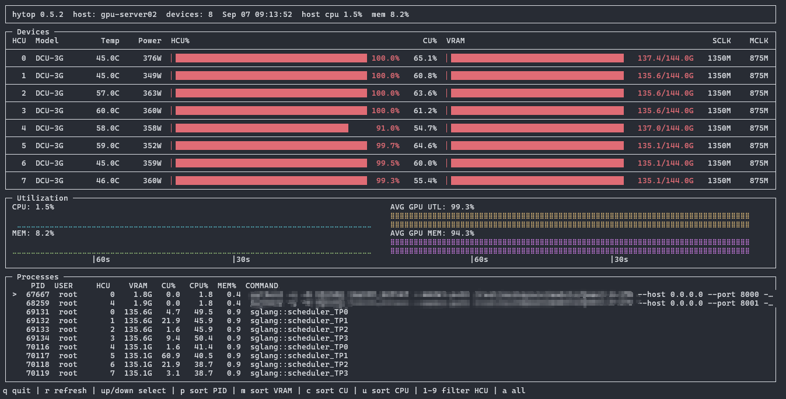

# hytop

[](#环境要求)
[](LICENSE)
[](https://www.python.org/)
[](#环境要求)
[](#环境要求)

**[English](README.md) | [简体中文](README.zh-CN.md)**

**面向海光 DCU（HCU）加速卡的 nvitop 风格终端监控工具** —— 只读监控、零第三方依赖，
实时利用率条形图、盲文历史波形、进程表，以及稳定的 JSON 输出。

hytop 与 `hy-smi` 走同一条路：通过 `ctypes` 调用 `librocm_smi64.so` 的标准
`rsmi_*` 接口。不同的是，它把这些数据变成了一个交互式的 top 风格界面：设备面板、
主机与 GPU 利用率波形、按卡细分的进程表、阈值变色，以及可供脚本/Agent 消费的
JSON schema。

> 已在 8 × HYGON DCU-3G（BW1100 代，`librocm_smi64.so.2.8`）上验证：
> 真实推理负载下各项指标与 `hy-smi` 一致 —— 单卡功耗 150 → 400 W、
> SCLK 升档 1200 → 1350 MHz、CU 占用 55–85%。

## 界面预览



<details>
<summary>字符版预览</summary>

```
┌──────────────────────────────────────────────────────────────────────────┐
│ hytop 0.5.2  host: dcu-node01  devices: 8  Sep 07 07:53:54             │
└──────────────────────────────────────────────────────────────────────────┘
┌─ Devices ────────────────────────────────────────────────────────────────┐
│ HCU  Model     Temp   Power  HCU%                             CU%  VRAM  │
├──────────────────────────────────────────────────────────────────────────┤
│  0  DCU-3G    44.0C   323W  ▏████████████  100.0%  67.2%  ▏███ 137.4/144G │
├──────────────────────────────────────────────────────────────────────────┤
│  1  DCU-3G    44.0C   298W  ▏████████████   99.3%  73.6%  ▏███ 135.6/144G │
└──────────────────────────────────────────────────────────────────────────┘
┌─ Utilization ────────────────────────────────────────────────────────────┐
│ CPU: 2.4%                            AVG GPU UTL: 94.4%                  │
│ ⠋⠋⠋⠋⠋⠋⠋⠋⠋⠋ （最近80秒）           ⣽⣾⣿⣿⣿⣿⣿⣿⣿⣿⣿⣿⣿⣿                 │
│ MEM: 8.2%                            AVG GPU MEM: 94.3%                  │
│ ⣀⣀⣀⣀⣀⣀⣀⣀⣀⣀                        ⣿⣿⣿⣿⣿⣿⣿⣿⣿⣿⣿⣿⣿⣿                 │
│                |60s        |30s      （时间轴，右端 = 现在）              │
└──────────────────────────────────────────────────────────────────────────┘
┌─ Processes ──────────────────────────────────────────────────────────────┐
│   PID  USER     HCU  VRAM    CU%   CPU%  MEM%  COMMAND                   │
│ 69131  root       0  135.6G  0.0   99.0   0.9  sglang::scheduler_TP0     │
│ 69132  root       1  135.6G  0.0   97.3   0.9  sglang::scheduler_TP1     │
└──────────────────────────────────────────────────────────────────────────┘
q 退出 | r 重绘 | ↑/↓ 选择 | p 按 PID 排序 | m 按 VRAM | c 按 CU% | u 按 CPU% | 1-9 过滤卡 | a 全部
```
</details>

实心渐变条形图（绿→黄→红）、盲文利用率波形（一个字符 = 一秒，纵向 8 级）、
阈值变色（温度 ≥65°C 黄 / ≥75°C 红，功耗 ≥80%/90% 功耗墙变色），面板盒分区。

## 快速开始

**pip** —— 机器上有 python ≥ 3.7 且已装海光 hyhal 驱动
（见[环境要求](#环境要求)）：

```bash
pip install https://github.com/gongshl0306/hytop/releases/download/v0.6.0/hytop-0.6.0-py3-none-any.whl
hytop --once
```

**uv** —— 机器 Python 版本太旧时。uv 自带独立 CPython 下载，
系统 Python 是什么版本无所谓：

```bash
curl -LsSf https://astral.sh/uv/install.sh | sh
uv python install 3.12
uv tool install --python 3.12 https://github.com/gongshl0306/hytop/releases/download/v0.6.0/hytop-0.6.0-py3-none-any.whl
hytop
```

**集群部署** —— 目标机完全不需要 pip（一次 rsync）：

```bash
./scripts/deploy.sh user@host /opt/hytop
ssh user@host 'ln -sfn /opt/hytop/bin/hytop /usr/local/bin/hytop'

# 之后在任意 DCU 节点、任意用户：
hytop                 # 交互式 TUI
hytop --once          # 打印一次文本快照
hytop --json          # 打印一次 JSON 快照（schema 稳定，null = 不支持）
```

**源码直跑 / 免安装：**

```bash
PYTHONPATH=src python3 -m hytop --once     # 在 DCU 节点上
./bin/hytop --backend mock                 # 任意机器：确定性 8 卡模拟
pip install .                              # 可选：正式安装（含命令行入口）
```

## 为什么做这个

海光 DCU 服务器自带 `hy-smi`，那是一个一次性文本工具；DCU 世界里没有 `nvitop`。
hytop 补上这个空缺，同时保留集群工具的部署方式：**一次 rsync，不用 pip，无需 root 安装**。

- **零依赖** —— `ctypes`（驱动 FFI）+ `curses`（TUI）+ `/proc` 解析。
  只要 `python3 ≥ 3.7` 能跑，hytop 就能跑。
- **数字诚实** —— 所有指标在后端完成单位换算（m°C→°C、µW→W、Hz→MHz），
  不支持的字段显示 `N/A`，绝不用 0 冒充。
- **与 `hy-smi` 对拍验证** —— 真实推理负载下逐卡对比；主机 CPU% 与 `top` 一致
  （busy 不含 idle/iowait/steal——早期版本把 idle 算进去导致恒显 ~100%，
  正是与 top 对拍时发现的）。
- **界面不卡死** —— 阻塞式采样由后台采集线程轮转完成，UI 永不阻塞在驱动调用上；
  单个指标读取失败降级为 `N/A`，不会崩。

## 环境要求

| 条件 | 说明 |
|---|---|
| Linux，`python3 ≥ 3.7` | 仅标准库 |
| 海光 hyhal 驱动栈 | `/opt/hyhal/lib/librocm_smi64.so`（或 `HYTOP_LIBRARY_PATH=/目录`） |
| 内核驱动已加载 | 存在 `/dev/kfd`、`/dev/dri/renderD*` |
| 设备节点可读 | 权限开放时非 root 可用（已验证） |

使用同一 RSMI 接口的其他代际海光 DCU 应当可用；不支持的指标自动降级为 `N/A`。
不适用于 NVIDIA GPU；AMD 原生 ROCm 的 API 同源但未适配未测试。没有驱动的机器上
会得到清晰可操作的报错（列出搜索路径与建议），而不是 traceback。

## 命令行

| 参数 | 说明 |
|---|---|
| `-d, --device 0,1,3` | 只看指定卡（同时过滤进程表） |
| `--interval SEC` | 刷新周期（默认 1.0） |
| `--window-ms MS` | HCU%/CU% 单卡采样窗口（默认 150） |
| `--once` | 打印一次文本快照并退出 |
| `--json` | 打印一次 JSON 快照并退出 |
| `--backend mock` | 无硬件模拟数据源 |
| `--frames N` | 无头渲染 N 帧后打印最后一帧并退出（测试/无 pty 环境） |
| `--version` | 版本号 |

TUI 按键：`q` 退出 · `r` 重绘 · `↑/↓` 选择 · `p/m/c/u` 按 PID/VRAM/CU%/CPU% 排序 ·
`1-9` 过滤卡 · `a` 显示全部。

### JSON

```json
{
  "hytop_version": "0.5.2",
  "timestamp": 1788489077.1,
  "host": {"cpu_percent": 2.2, "memory_percent": 8.2},
  "devices": [{
      "index": 0, "name": "HYGON DCU-3G", "pci_bus_id": "0000:05:00.0",
      "numa_node": 0, "cu_count": 64,
      "utilization": 100.0, "cu_utilization": 84.9,
      "memory_used": 137408905216, "memory_total": 154602045440,
      "temperature": {"edge": 44.0, "junction": 50.0, "memory": 55.0, "core": 41.0},
      "power": 323.0, "power_cap": 800.0, "sclk_mhz": 1350.0, "mclk_mhz": 875.0
  }],
  "processes": [{
      "pid": 69131, "username": "root", "command": "sglang::scheduler_TP0",
      "cpu_percent": 99.0, "host_memory": 934598656, "host_memory_percent": 0.9,
      "devices": {"0": {"vram_used": 145681686528, "cu_occupancy": 7.8, "sdma_usage": 0}}
  }],
  "errors": []
}
```

## 架构

```
TUI (curses) / CLI / --json
        │  只消费 SystemSnapshot（含每卡历史序列）
    Collector（后台线程：瞬时指标每轮全采 + 阻塞式 HCU%/CU% 窗口轮转采样）
        │
    HCUBackend 协议
    ┌────┴──────────┐
 NativeBackend    MockBackend
    │
 ffi/rsmi.py (ctypes) → librocm_smi64.so → HCU 内核驱动 → DCU
 host/proc.py (/proc)  → USER / CPU% / RSS / COMMAND
```

Backend 拿准原始数据并换算单位，Collector 负责采样与缓存，models 定义数据契约，
UI 只做渲染。开发用 MockBackend 可在任何无卡机器上进行；193 个单元测试不需要真卡。

## 指标口径（均经负载下对拍）

- **HCU% / CU%** —— 驱动窗口采样（`rsmi_dev_hcu_util_get` /
  `rsmi_dev_cu_util_get`，150ms），跨卡轮转：8 卡约 2.7 秒全量刷新一轮，
  未轮到的卡显示上一次测量值。该驱动没有可用的非阻塞利用率接口——三个候选
  API 在现有海光驱动上均返回哨兵数据。
- **VRAM** —— `rsmi_dev_memory_usage_get` 原样报告。空载 ~94% 是驱动预留
  HBM（与 hy-smi 一致），因此刻意不做变色告警。
- **功耗** —— `rsmi_dev_power_get`（µW→W）；功耗墙通常 800W。
- **温度** —— Edge / Junction / Memory / Core 四传感器。
- **进程行** —— 每卡显存来自 `rsmi_compute_process_info_by_device_get`，
  CU% 优先 `rsmi_dev_proc_usage_get`；USER / RSS / CPU% / COMMAND 解析自 /proc。
- **主机 CPU%** 与 `top` 一致（busy = user+nice+system+irq+softirq，按核数归一化）；
  **主机 MEM%** = (total − available) / total。

## 已知限制

- 只读设计：无调频/功耗控制/复位/MIG/kill。
- 8 卡时 HCU%/CU% 最多滞后 ~2.7 秒（阻塞窗口采样是该驱动唯一真实来源）。
- 尚无 PCIe 吞吐、ECC、Hylink 拓扑、CSV 落盘、容器感知（PCIe 字段已探明可用）。
- 在 BW1100 代硬件上验证；其他代际可能部分指标 N/A。

## Python API

hytop 同时提供一套小型只读 Python API（nvitop 风格门面）：

```python
from hytop import Device, snapshot

Device.count()                       # 8
dev = Device(0)
dev.name                             # 'HYGON DCU-3G'
dev.memory_used_human()              # '136.2G'

m = dev.snapshot()                   # 窗口采样 HCU%/CU% + 全部瞬时指标
m.power, m.temperature.edge          # 323.0, 44.0

for proc in dev.processes():         # 这张卡上的进程
    print(proc.pid, proc.username, proc.vram_used_human(0))

snap = snapshot()                    # 全机 SystemSnapshot
```

后台采集器支持回调，便于自定义集成（日志、看板、Agent 循环）：

```python
from hytop import Collector, MockBackend

def on_collect(snap):
    print(snap.timestamp, snap.devices[0].utilization)
    return True   # 返回 False 即停止

Collector(MockBackend(), interval=1.0, on_collect=on_collect).start()
```

没有真卡？`Device.use_mock()`（或 `--backend mock`）切换到确定性模拟器，
API 行为完全一致。

## 参与

```bash
PYTHONPATH=src python3 -m unittest discover -v   # 193 个测试，无需真卡
./bin/hytop --backend mock --frames 3            # 无头预览一帧
```

FFI 的事实依据（已验证的签名、结构体尺寸、驱动怪癖）以
内联注释的形式写在 `ffi/rsmi.py` 中 —— 修改绑定前请先阅读。
欢迎 PR：bug 修复、新的只读指标、打包改进。

## 许可证

[MIT](LICENSE)
